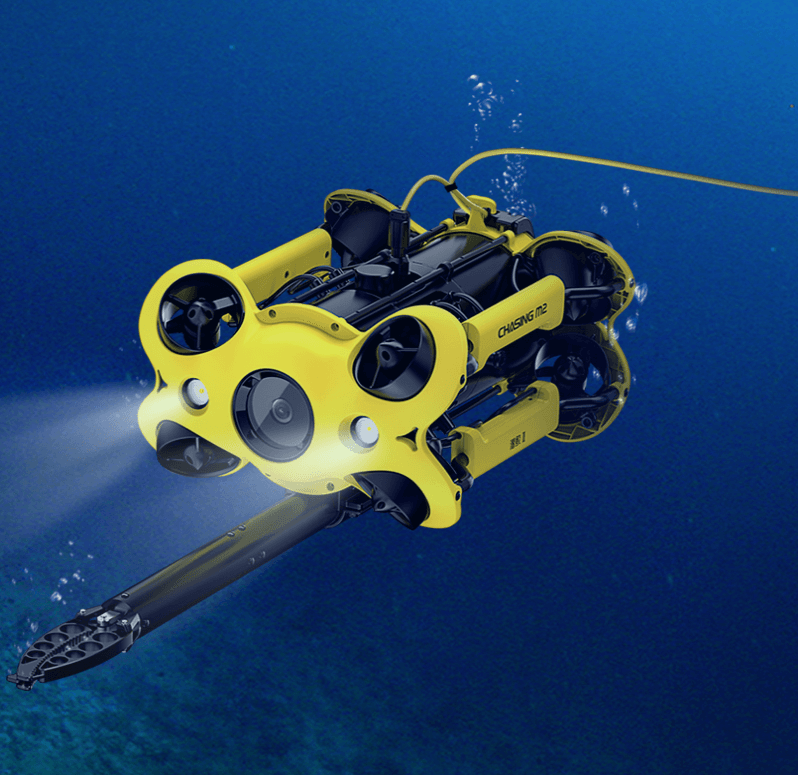

# Systeem Design voor de Onderzeedrone Simulatie

## **Inleiding**  
Dit systeem design document bouwt voort op de eerder vastgestelde requirements uit de requirementanalyse voor de onderzeedrone simulatie. Het doel van dit document is om de algemene architectuur, de belangrijkste systeemcomponenten en hun verantwoordelijkheden te definiëren, zonder in te gaan op specifieke code-implementaties. Het vormt de basis voor het Architecture Design Document dat in een latere fase wordt ontwikkeld.

---

## **Systeemoverzicht**  
De onderzeedrone simulatie is een virtuele omgeving die wordt gebruikt door de brandweer voor training en door ontwikkelaars voor het testen van firmware. Het systeem simuleert een realistische onderwateromgeving waarin gebruikers kunnen interacteren met een virtuele representatie van de onderzeedrone.

---

## **Algemene Architectuur**  
De architectuur van de onderzeedrone simulatie volgt een modulair ontwerp met gescheiden verantwoordelijkheden. Het bestaat uit de volgende hoofdcomponenten:

| **Component** | **Beschrijving** | **Gerelateerde Requirements** |
|---------------|-------------------|------------------------------|
| **Simulatie Engine** | De kern van het systeem, verantwoordelijk voor het modelleren van fysieke interacties | FR-01, FR-07, FR-08, NFR-01 |
| **User Interface (UI)** | Stelt gebruikers in staat te interacteren met de simulatie | FR-03, UC-01 t/m UC-06 |
| **Scenario Manager** | Beheert trainingsscenario's en instellingen | FR-02, UC-09 |
| **Firmware Interface** | Maakt integratie en testen van drone-firmware mogelijk | FR-05, FR-06, UC-08 |
| **Logging & Analytics** | Verzamelt en analyseert gebruikersgegevens en systeemprestaties | FR-04, UC-10, NFR-01 |
| **Security Manager** | Beheert toegang en beveiliging | NFR-03 |
| **Data Storage** | Beheert de persistentie van gegevens | NFR-02, NFR-04 |

---

## **Componentbeschrijvingen**  

### **1. Simulatie Engine**  
De Simulatie Engine vormt het hart van het systeem en is verantwoordelijk voor het nauwkeurig modelleren van de onderwateromgeving en het gedrag van de onderzeedrone.

#### **Subcomponenten:**
- **Physics Engine**: Simulatie van natuurkundige eigenschappen zoals drijfvermogen, weerstand en inertie
- **Omgevingssimulator**: Simuleert waterstroming, temperatuur, zichtbaarheid en andere omgevingsfactoren
- **Hardware Emulator**: Virtuele representatie van de drone-hardware (sensoren, motoren, camera's)
- **Collision Detection**: Detecteert botsingen met objecten in de omgeving
- **Storingsmodule**: Genereert realistische storingen en fouten voor trainingsdoeleinden

#### **Verantwoordelijkheden:**
- Nauwkeurige fysieke simulatie van de drone en omgeving (FR-01)
- Realistische weergave van het gedrag van de drone-hardware (FR-07)
- Simulatie van storingen en defecten voor training en testen (FR-08)
- Garanderen van real-time prestaties zonder merkbare vertragingen (NFR-01)

#### **Interfaces:**
- **Input**: Besturingscommando's van de UI, omgevingsparameter wijzigingen, firmware commando's
- **Output**: Status van de drone, sensorgegevens, positie-updates, foutmeldingen

---

### **2. User Interface (UI)**  
De User Interface zorgt voor een intuïtieve interactie tussen de gebruikers en het simulatiesysteem, met verschillende interfaces voor de verschillende gebruikersrollen.

#### **Subcomponenten:**
- **Dashboard**: Overzicht van de simulatiestatus en belangrijkste gegevens
- **Besturingsinterface**: Voor het navigeren en bedienen van de onderzeedrone
- **Configuratiescherm**: Voor het aanpassen van simulatieparameters
- **3D Visualisatie**: Visuele weergave van de onderwateromgeving en de drone
- **Trainingsoverzicht**: Toont voortgang en prestaties tijdens trainingssessies

#### **Verantwoordelijkheden:**
- Bieden van een intuïtieve, gebruiksvriendelijke interface (FR-03)
- Ondersteunen van verschillende gebruikersrollen (trainers, agenten, ontwikkelaars)
- Visualiseren van de simulatieomgeving en de drone
- Faciliteren van interactie met de simulatie

#### **Interfaces:**
- **Input**: Gebruikersinteracties, configuratie-instellingen
- **Output**: Visuele weergave van de simulatie, statusupdates, prestatiegegevens

---

### **3. Scenario Manager**  
De Scenario Manager beheert de verschillende trainingsscenario's en maakt het mogelijk voor trainers om aangepaste scenario's te creëren.

#### **Subcomponenten:**
- **Scenario Editor**: Interface voor het maken en bewerken van scenario's
- **Scenario Library**: Verzameling van vooraf gedefinieerde en aangepaste scenario's
- **Scenario Runtime**: Uitvoering en monitoring van actieve scenario's
- **Event Trigger**: Activeert specifieke gebeurtenissen binnen scenario's

#### **Verantwoordelijkheden:**
- Beheren van vooraf ingestelde trainingsscenario's (FR-02)
- Ondersteunen van het aanmaken van nieuwe scenario's (UC-09)
- Configureren van omgevingsparameters per scenario
- Integreren van realistische noodsituaties in scenario's

#### **Interfaces:**
- **Input**: Scenario-selectie, parameters, gebeurtenistriggers
- **Output**: Geladen scenario-configuraties, gebeurtenissen, voortgangsupdates

---

### **4. Firmware Interface**  
De Firmware Interface maakt de integratie en het testen van drone-firmware mogelijk zonder fysieke hardware.

#### **Subcomponenten:**
- **Firmware Loader**: Laadt firmware in de simulatieomgeving
- **Hardware Abstraction Layer (HAL)**: Abstractie tussen firmware en gesimuleerde hardware
- **Debugging Console**: Toont firmware-logs en diagnostische informatie
- **Test Automation**: Automatiseert firmware tests

#### **Verantwoordelijkheden:**
- Faciliteren van firmware-integratie en testen (FR-05)
- Bieden van uitgebreide logging en debugging mogelijkheden (FR-06)
- Verzorgen van een nauwkeurige hardware-emulatie (FR-07)
- Ondersteunen van het testen van firmware in verschillende scenario's (UC-08)

#### **Interfaces:**
- **Input**: Firmware code, testconfiguraties, debug commando's
- **Output**: Testresultaten, diagnostische informatie, logs

---

### **5. Logging & Analytics**  
De Logging & Analytics component verzamelt, bewaart en analyseert gegevens over de simulatie en de prestaties van gebruikers.

#### **Subcomponenten:**
- **Data Collector**: Verzamelt gegevens van verschillende systeemcomponenten
- **Performance Analyzer**: Analyseert prestaties van zowel het systeem als de gebruikers
- **Report Generator**: Genereert rapporten en visualisaties
- **Feedback Module**: Biedt feedback aan gebruikers tijdens en na trainingssessies

#### **Verantwoordelijkheden:**
- Registreren en evalueren van gebruikersprestaties (FR-04)
- Faciliteren van prestatie-analyse na trainingssessies (UC-10)
- Verzamelen van gegevens voor systeemverbetering
- Genereren van inzichtelijke rapporten

#### **Interfaces:**
- **Input**: Simulatiegegevens, gebruikersacties, systeemgebeurtenissen
- **Output**: Prestatierapporten, analyseresultaten, exporteerbare gegevens

---

### **6. Security Manager**  
De Security Manager zorgt voor de beveiliging en toegangscontrole binnen het systeem.

#### **Subcomponenten:**
- **Authentication Module**: Beheert gebruikersauthenticatie
- **Authorization Module**: Controleert toegangsrechten
- **Encryption Service**: Versleutelt gevoelige gegevens
- **Audit Logger**: Registreert veiligheidsgerelateerde gebeurtenissen

#### **Verantwoordelijkheden:**
- Waarborgen van de beveiliging van het systeem (NFR-03)
- Controleren van gebruikerstoegang op basis van rollen
- Beschermen van firmware en simulatiegegevens
- Bijhouden van een audit trail van veiligheidsgerelateerde acties

#### **Interfaces:**
- **Input**: Inloggegevens, toegangsverzoeken, beveiligingsbeleid
- **Output**: Authenticatieresultaten, toegangscontrole beslissingen, audit logs

---

### **7. Data Storage**  
De Data Storage component beheert de persistentie van alle systeemgegevens.

#### **Subcomponenten:**
- **Configuration Storage**: Bewaart systeem- en gebruikersconfiguraties
- **Scenario Database**: Slaat scenario's en gerelateerde gegevens op
- **Performance Database**: Bewaart prestatiegegevens en trainingsresultaten
- **Log Repository**: Archiveert systeemlogs en gebeurtenissen

#### **Verantwoordelijkheden:**
- Waarborgen van gegevensintegriteit en beschikbaarheid
- Ondersteunen van compatibiliteit met bestaande systemen (NFR-02)
- Faciliteren van schaalbaarheid voor toekomstige uitbreidingen (NFR-04)
- Beheren van gegevensretentie en -archivering

#### **Interfaces:**
- **Input**: Te bewaren gegevens, query verzoeken
- **Output**: Opgehaalde gegevens, bevestiging van opslagoperaties

---

## **Systeeminteracties**  

### **Belangrijkste Interactiesequenties**

#### **1. Trainingssessie Uitvoeren**
1. Brandweer Trainer selecteert een scenario via de UI
2. Scenario Manager laadt het scenario in de Simulatie Engine
3. Trainer configureert de omgevingsparameters (stroming, temperatuur, zichtbaarheid)
4. Simulatie Engine initialiseert de omgeving en de drone
5. Brandweer Agent bestuurt de drone via de UI
6. Simulatie Engine verwerkt commando's en actualiseert de simulatie
7. Logging & Analytics verzamelt gegevens tijdens de sessie
8. Na afloop genereert de Logging & Analytics prestatierapporten

#### **2. Firmware Testen**
1. Firmware Ontwikkelaar laadt firmware via de Firmware Interface
2. Security Manager verifieert toegangsrechten
3. Firmware Interface integreert de firmware met de Hardware Emulator
4. Ontwikkelaar configureert testscenario's
5. Simulatie Engine voert de tests uit
6. Logging & Analytics verzamelt testgegevens
7. Firmware Interface toont debugging informatie
8. Logging & Analytics genereert testrapport

---

## **Technische Vereisten**  

### **Hardwarevereisten**
| **Categorie** | **Minimale Specificatie** | **Aanbevolen Specificatie** |
|---------------|---------------------------|----------------------------|
| **Processor** | Quad-core, 2.5 GHz | Octa-core, 3.5 GHz of hoger |
| **Geheugen** | 8 GB RAM | 16 GB RAM of meer |
| **Grafische kaart** | DirectX 11 compatibel | NVIDIA GTX 1660 of hoger |
| **Opslag** | 20 GB beschikbare ruimte | 50 GB SSD opslag |
| **Netwerk** | 1 Gbps LAN-verbinding | Dedicated server verbinding |
| **Monitor** | 1080p resolutie | 1440p of hoger, multi-monitor ondersteuning |

### **Softwarevereisten**
| **Categorie** | **Vereiste** |
|---------------|-------------|
| **Besturingssysteem** | Windows 10/11, Linux (Ubuntu 20.04 of nieuwer) |
| **Ontwikkelomgeving** | Visual Studio 2019 of nieuwer, VS Code |
| **Databases** | PostgreSQL 12 of nieuwer |
| **Virtualisatie** | Docker ondersteuning voor containerisatie |
| **Frameworks** | .NET Core 6.0, Unity 2021 of nieuwer |

---

## **Systeemgrenzen en Externe Interfaces**  

### **Systeemgrenzen**
De simulatie is een zelfstandig systeem met de volgende grenzen:
- Simuleert alleen de onderzeedrone en de directe onderwateromgeving
- Beperkt tot trainings- en testdoeleinden, geen operationeel gebruik
- Geen directe koppeling met echte drone-hardware
- Geen integratie met externe brandweersystemen tenzij expliciet gespecificeerd

### **Externe Interfaces**
| **Interface** | **Beschrijving** | **Protocol** |
|---------------|-------------------|-------------|
| **IT-infrastructuur** | Verbinding met bestaande netwerk- en authenticatiesystemen | LDAP, OAuth |
| **Gegevensexport** | Export van trainingsresultaten en logs | CSV, JSON, PDF |
| **Hardware Controller** | Optionele aansluiting voor fysieke besturingsapparatuur | USB, Bluetooth |

---

## **Schaalbaarheid en Uitbreidbaarheid**  
Het systeem is ontworpen met toekomstige uitbreidingen in gedachten, waaronder:

- Ondersteuning voor meerdere typen onderzeedrones
- Uitbreiding naar andere use cases buiten de brandweer
- Toevoeging van meer complexe omgevingssimulaties
- Integratie met VR/AR-technologieën
- Ondersteuning voor multigebruikerssimulaties

---

## **Risico's **  
TBD

## **Conclusie**  
Dit systeem design document schetst de algemene structuur en componenten van de onderzeedrone simulatie. Het vormt de basis voor het gedetailleerde Architecture Design Document dat zal volgen. De modulaire opzet met duidelijk gescheiden verantwoordelijkheden zorgt voor een flexibel en uitbreidbaar systeem dat aan de vastgestelde requirements voldoet. 

De focus ligt op een realistische simulatie voor trainingsdoeleinden en een betrouwbare omgeving voor firmware-ontwikkeling en -testen. Door deze holistische aanpak kunnen alle stakeholders met hoge invloed en belang optimaal worden bediend.